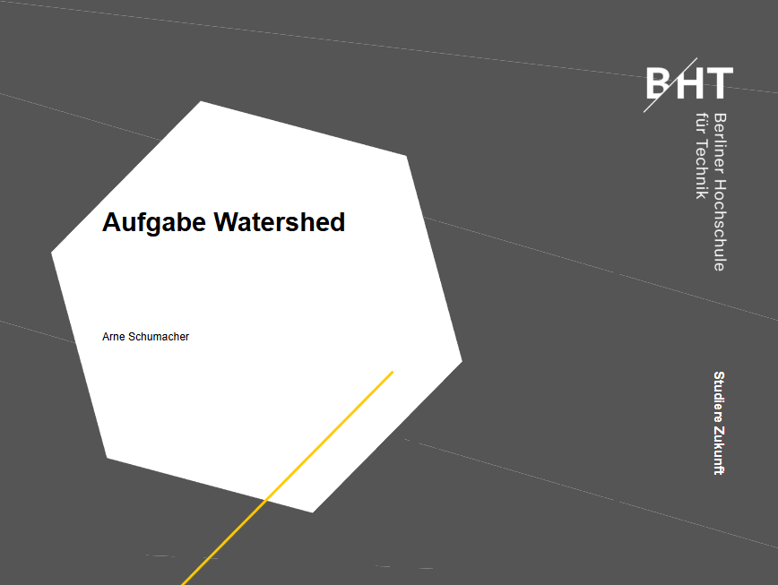
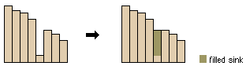
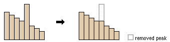
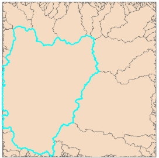

- Diese Übung simuliert den Oberflächenabfluss anhand eines Höhenmodells
Öffnen Sie ArcGIS Pro und erstellen Sie ein neues Projekt mit Karte und Geodatabase
- Laden sie das Tiff „ausschnitt_harz.tif“ in die geodatabase und fügen Sie es der Karte hinzu

**1. Wie gehen Sie vor (letzten 2 Punkte)?**

- Als Vorbereitung säubern wir unser Raster und korrigieren fehlerhafte peaks und sinks

**2. Welches Werkzeug in den Hydrology-Werkzeugen (Spatial Analyst) ermöglicht das?**

**3. Welche Oberfläche müssen wir zunächst für die Wasserscheiden berechnen?**
  - Benutzen Sie als Input das gerade erstellte Raster „ausschnitt_harz_fill“ und benutzen Sie die D8-Methode
  - Zoomen Sie auf den Punkt 609.286,5, 5.732.838,5
  - Tipp: Finden Sie den Punkt über „zu XY wechseln“ („Go to XY“)
**4. Dieser Wert beträgt 4. Was bedeutet das und wie wurde er errechnet? Welchen Wert enthält der Nordpixel und was bedeutet das? **

**5. Berechnen Sie für unser Zentrumpixel die Neigungen für die 2 Pixel mit dem stärksten Gefälle (in Grad und Prozent) per geometrischer Formel, d.h. außerhalb ArcGIS**

- Berechnen Sie diese Werte aus den Höhenangaben des Ursprungsrasters (das ausgegeben wurde)! Dies gilt für alle Berechnungen, die mit Neigung zu tun haben (also bis inkl. Folie 5, ab Folie 6 wieder mit dem gesäuberten Raster)

**6. In welcher Richtung liegen die 2 Pixel mit dem stärksten Gefälle?**

- Berechnen Sie nun die Neigungsoberfläche mit ArcMap (slope) für das Höhenmodell in Grad und Prozent
Überprüfen Sie die von ihnen berechneten Wert des stärksten Gefälle mit denen des Rasters

**7. Was ist der von ArcGIS errechnete Wert (in Grad und Prozent) unseres Zentrumspixels?**

- Schauen wir uns diese Berechnung genauer an. Wir werden dies mit Python und der Bibliothek numpy (numerical python) berechnen. Öffnen Sie dazu das Python-Fenster (gerne auch mit einer anderen IDE wie Jupyter Notebook, Spyder etc.) Gehen Sie wie folgt vor:
    - Importieren Sie die Bibliothek numpy
    - Setzen Sie die räumliche Auflösung als Variable „sr“ (spatial resolution) und seinem Wert fest
    - Bauen Sie einen 2-D array mit unseren 9 Pixeln, d.h. 3 Zeilen => array.shape = (3,3)!
    - Wir brauchen für die Berechnung in ArcGIS jeweils 2 Spalten und 2 Zeilen (siehe Hilfe). Extrahieren Sie diese 4 arrays jeweils in eine Variable.
    - Tipp(s):
        - Bei den Zeilen kann man das leicht mit indexing machen, bei den Spalten (d.h. z. B. für Spalte 2 müssen wir aus jedem Zeilenarray das 2te Element extrahieren. Benutzen sie hierfür Array Slicing.
        - Reduzieren Sie dabei den Zielarray von 2 auf 1-D z. B. mit den numpy-Funktionen squeeze oder ravel
    - Bauen Sie nun in Python und numpy unter Anleitung der Hilfe und den extrahierten 1-D arrays (man kann hier wieder mit Indexing auf die Skalarwerte zugreifen!) die Formel zu Berechnung des Wertes in Grad und Prozent nach! Beweisen Sie, dass Sie die gleichen Ergebnisse wie in Frage 7 bekommen! 

**8. Wie lautet das vollständige Script?**

**9. Was ist der wesentliche Unterschied der Berechnungen zwischen Frage 5 und (7 & 8)?**

**10. Was für eine Art von Operator ist dieses Werkzeug?**  
**11. Dieser Operator betrachtet die lokale Umgebung genau der Pixel, die mit der Urzelle mindestens einen gemeinsamen Punkt haben. Wie nennt man diese Nachbarschaft und wie viele Pixel definiert Sie als Nachbarn?**   
**12. Wie heißt die auch oft angegebene Nachbarschaft in der Pixelwelt, die Pixel als Nachbarn definiert, die nur eine gemeinsame KANTE besitzen und wie viele Pixel sind das?**

- Als nächstes wollen wir eine akkumulative Oberfläche, die alle Zuflusszellen pro Pixel addiert (gleichwertig)

**13. Welches Werkzeug ist das und welches Input Raster brauchen wir?**  
**14. Was bedeuten die Werte der Rasterzellen?**  
**15. Welche Art von Operator ist dieses Werkzeug?**  

- Extrahieren sie das Flusssystem anhand eines entsprechenden Wertes 
    - Für welchen Wert entscheiden sie sich!
    - Tipp: Benutzen Sie ein Werkzeug im Spatial Analyst, um mit dem von ihnen gewählten Schwellenwert ein Raster zu erzeugen, das ein binäres Outputraster erzeugt, d.h. Werte zwischen 0 (z.B. für Werte < 5) und 1 (z.B. für Werte > 5)

**16a. Wie heißt das Tool und die Formel?**  
**16b. Erklären Sie bitte auch den Namen und Funktion des Toolsets, d. h. in welcher Kategorie dieses Tool zu finden ist!**  
**17. Welcher Art von Operator nutzt man im Raster Calculator?**  

- In einem weiteren Schnitt wollen wir aus diesem Netz die Abschnitte, d.h. die Verbindungen zwischen den Knoten extrahieren

**18. Welches Tool brauchen wir, was geben wir als Eingaberaster (mehrere!) an und was bedeuten die Ganzzahlen im Ausgaberaster**   

- Aus diesen Abschnitten bilden wir nun noch die Ordnung, d.h. die hierarchische Gliederung innerhalb des Systems

**19. Welches Tool brauchen wir, was sind die Eingaberaster und wie ist das Outputraster zu interpretieren?**  

- Wir befinden uns immer noch bei Rasteroberflächen. In einem letzten Schritt konvertieren wir dies in ein Liniennetz

**20. Welches Tool brauchen wir dazu, welche Raster geben wir an und welche Spalte verrät uns die hierarchische Ordnung einer jeder Linie in der Output-Feature-Class?**  
**21. Welches Werkzeug generiert uns die Oberfläche der Talbecken, d.h. die Einzugsgebiete (Wasserscheiden)?**  

- Konvertieren Sie das Raster der Einzugsgebiete in Polygone!
- Clippen Sie das Flusssystem mit dem unten markierten Einzugsgebiet, sodass nur Flüsse innerhalb diesem vorkommen

**22. Wie gehen Sie vor?**  

- Exportieren sie das geclippte Flusssystem als KML, laden sie es in Google Earth und diskutieren sie die Ergebnisse!

**23. Diskutieren Sie kurz die topologische und topographische Bedeutung des extrahierten Flusssystems!**

