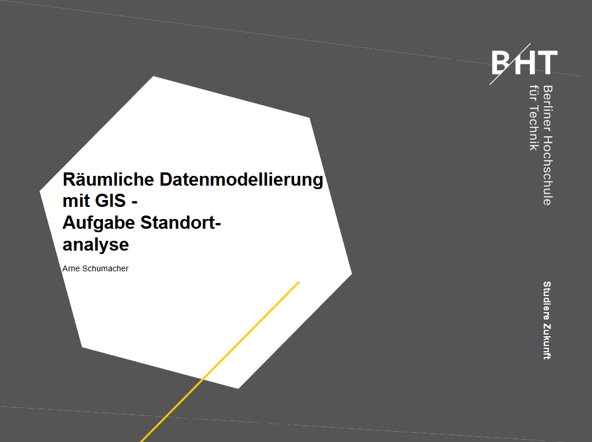
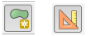

# Aufgabe 2: Standortanalyse

- Kreieren Sie ein Konto bei NASA‘s Earth Observing System Data and Information System (EOSDIS)
- https://search.earthdata.nasa.gov/search
- Geben Sie in der Suchmaske „Aster“ ein und clicken sie auf „ASTER Global Digital Elevation Model V003“
  - ! Achtung: Diesen Eintrag gibt es 2 mal, achten Sie auf das GDEM im GeoTIFF-Format
  - Zoomen Sie auf den Harz und spannen dort ein Rectangle auf
  - Downloaden Sie:
    - ASTGTMV003_N51E010.zip
- Sie können die Aster-Daten auch über den Earth Explorer herunterladen.
  - Gehen Sie auf den Tab “Data Sets” – Digital Elevation – Aster Global DEM 
  - Definieren Sie das Rechteck über Search Criteria – Coordinates – Use Map und ändern Sie das Rechteck entsprechend unserer Gegend

1. Was ist Aster? (Kurze Erklärung). Wie wird insbesondere das Höhenmodell gewonnen?

- Laden Sie das Höhenmodell „ASTGTM2_N51E010_dem“in QGIS 

2. Welche Projektion hat das Raster? Welche Länge der Halbachsen liegen diesem Ellipsoid zugrunde und wie groß ist die Abplattung?

- Stellen Sie das Kartenkoordinatensystem auf UTM32 um 
- Erstellen und speichern Sie ein neues Polygon- Shapefile in UTM 32
- Schalten Sie das Shapefile in Editiermodus und erweitern Sie das Menü um die Leiste: „Erweiterte Digitalisierungswerkzeugleiste“ (Advanced Digitizing)
  - Clicken Sie erst auf Add Feature (Editierleiste) und danach auf „Erweiterte Digitalisierungswerkzeuge einschalten“  
  

- Geben Sie in den erweiterten Einstellungen die Koordinaten: 575000 (X) und 5760000 (Y) an und sperren Sie beide Koordinaten
- Bestätigen Sie die Koordinate im Kartenfenster (Click überall möglich) und die Koordinate wird gesetzt
- Geben Sie die zweite Koordinate mit 634000 und 5760000 an und sperren Sie wiederum die Koordinaten
- Bestätigen Sie die zweite Koordinate wieder mit Click ins Kartenfenster
- Wiederholen sie den Vorgang für Koordinate 3 (634000, 5700000), Koordinate 4 (575000, 5700000) und wiederum der Ursprungskoordinate (575000, 5760000)
- Das Polygon ist nun geschlossen. Mit einem Rechtsclick vergeben Sie noch die ID 1 und das Polygon ist fertig.
- Speichern Sie das Polygon und beenden Sie den Editiermodus
- Wir haben ein Polygon erstellt, das wir zum Clippen benutzen wollen

- Transformieren Sie mit dem Tool „Warp“ (dt. „Transformieren (Reprojizieren“)  das Höhenmodell in UTM 32 (Datum: ETRS-89)

3. Welche ESPG-Codes müssen wir für Source SRS und Target SRS angeben?
    - Lassen Sie die anderen Parameter bitte voreingestellt!
    - Output: N51E010_utm32_dem.tif
- Clippen Sie nun das transformierte Raster mit unserem Shapefile. Geben Sie dafür unser Shapefile als „Mask Layer“ an!
    - Output: ausschnitt_harz_utm32.tif

- Erstellen Sie nun die Höhenlinien (Contour) aus dem Höhenmodell
    - Geben Sie hierfür ein Outputshapefile an, 100m als Intervallgrenze und Attribute name: ELEV
- Schauen sie im Original-Höhenmodell unter Eigenschaften in den Statistikwerten nach, was der höchste Punkt ist.

4. Stimmt dieser Wert? Wie kriegen wir für unser Höhenmodell die Einstellungen so angepasst, dass auch unsere Extremwerte richtig in der Statistik angezeigt werden?
- Finden Sie anhand der Höhenlinien den ungefähren Punkt der höchsten Erhebung auf dem Raster
5. Bei welcher Koordinate liegt dieser ca., wie heißt er und wie ist die Höhe des Berges im Vergleich durch eine Internetrecherche?

6. Schauen Sie sich in den Metadaten des geclippten 	Höhenmodells die Pixelauflösung an. Was stellen Sie fest?
- Dies ist für eine Vielzahl an Tools in QGIS nicht geeignet. Wir müssen einen Weg finden eine exakte räumliche Auflösung für x und y zu finden. Dies ist nicht über die Maske „Transformieren“ möglich
- In der Warp-Maske sehen Sie unten einen Kommandozeilen-Befehl. Diesen müssen wir in der Kommandozeile (cmd.exe) anwenden, um das gewünschte Resultat zu erzielen.
- Dies sind mächtige Kommandozeilenwerkzeuge, die z.B. im batch processing Verwendung finden (um Massendaten zu automatisieren)

9. Finden Sie das Verzeichnis, wo sich die „gdalwarp.exe“ versteckt. Wo ist das? 
10. Suchen Sie sich aus diesem Ordner ein weiteres GDAL-Tool aus und erklären Sie dessen Bedeutung!
- Öffnen Sie die Kommandozeile „cmd“ und ändern Sie den Pfad auf das Verzeichnis mit den GDAL-Tools

```bash
cd “Pfad zum Verzeichnis“
gdalwarp
```

- Sie sollten nun die Hilfe für das Werkzeug erhalten
- Kreieren Sie eine *.bat-Datei und öffnen Sie diese. In die erste Zeile kommt der cd-Befehl
  - !! Arbeiten Sie auf einem anderen Laufwerk (d.h .sie schreiben die Batch z.B. auf einem USB-Stick müssen 3 Zeilen angeben werden, hier steht vor dem cd-Befehl noch die Änderungen des Laufwerks durch z.B. „C:“ 
- Nun (zweite bzw. dritte Zeile) müssen wir zunächst gdalwarp angeben:
```bash
gdalwarp –flag Wert1 –flag2 Wert2 ….
```
- Hier müssen Sie Parameter wie Quell-CRS, Ziel-CRS, Clip-Ausdehnung, die x,y Auflösung (wir wollen eine Auflösung von 25m für x und y!), das Source-File (!! Ursprungshöhenmodell) und das Ziel-File angeben!!
  - ! Achten Sie darauf, keine Umlaute in Pfad und Datei zu verwenden. Bei Leerzeichen Pfad und Datei in „“ setzen !
- Tipp: Schreiben Sie in die letzte Zeile „PAUSE“. Dies verhindert, dass die Kommandozeile sofort wieder verschwindet. So kann man die Fehler bzw. die Fertigstellung erkennen.

11. Wie heißt der vollständige gdalwarp-Befehl, das uns für die gleichen Koordinaten wie das Polygon das umprojizierte Raster in x, y 25m Auflösung generiert? (Aus dem Original-Höhenmodell!)

 Laden Sie das neu erstellte Höhenmodell und entfernen Sie alle weiteren Layer aus dem TOC!
- Erstellen Sie in QGIS aus dem Höhenmodell ein Hillshade  
12. Welches Tool ermöglicht das?
  - Output: harz_utm32_hs.tif
  - Alle anderen Parameter können sie belassen  
8. Auf wie viel Grad setzt QGIS die Sonne und welcher Himmelsrichtung entspricht das?
9. Überprüfen Sie die Standardeinstellungen für ein Hillshade in ArcMap! Was stellen Sie fest?

- Wir wollen nun auch ein Neigungs-und Expositionsraster unseres Harz-Ausschnittes (d.h. mit dem Höhenmodell ausschnitt_harz_utm32.tif) mit einer *.bat-Datei schreiben.
- Erstellen sie analog des Warp-Befehls das Neigungsraster in Grad mit dem Zevenbergen Thorne Algorithmus. 
- Erstellen Sie in einer weiteren Zeile ein Expositionsraster (aspect) ähnlich der vorherigen Zeile mit dem Zevenbergen Thorne Algorithmus

13. Wie lautet das komplette *.bat file, das unsere 3 Oberflächen (umprojiziertes und geclipptes DEM, Slope und Aspect) generiert?
14. Welche Art von Rasteroperator ist die Neigungs- und Expositionsberechnung?

- Bevor wir zur Standortanalyse zurückkehren, machen wir noch einen Abstecher zur Automatisierung. Wir haben ja schon festgestellt, dass Kommandozeilenwerkzeuge ideal geeignet sind, um Batch-Processing zu vereinfachen. Denken Sie an die Transformation hunderter Luftbilder in ein anderes Koordinatensystem, das manuell sehr arbeits- und zeitintensiv wäre.
- Wir werden und nun einem ähnlichen Beispiel zuwenden. Nehmen wir an, wir haben einen Ordner mit unzähligen Bildern, von denen wir weder Projektion noch Ausdehnung wissen.
- Ziel dieser Aufgabe ist es, die Metadaten aller Dateien (bei uns die gerade erstellten *.tif) in einem Ordner auszulesen und in einer Textdatei zu speichern, um eine bessere Übersicht der darin enthaltenen Dateien zu bekommen. 

- Dazu bauen wir wieder eine Batch-Datei auf und gehen wie folgt vor:
  - Wir brauchen in Zeile 1 wieder den Verweis auf das C-Laufwerk
  - Zeile 2 beinhaltet das Wechseln auf unser benötigtes GDAL-Werkzeug (gdalinfo.exe)
  - Nun definieren wir die Variablen
    - Variablen werden in der Kommandozeile:
      - Gesetzt (set folder=xxx !!! Keine Leerzeichen !!!) und 
      - Aufgerufen (echo %folder%)
    - Definieren Sie eine Variable für den Ordner und einen für die Logdatei (d.h. nur den Namen, z.B. log.txt)
    - Lassen Sie sich zunächst die Logdatei zusammengesetzt aus Ordner und Dateiname ausgeben (echo), um den ersten Teilerfolg verbuchen zu können (nur über echo und nicht in die Textdatei)
    - Weil wir den Text an die Datei anhängen (! Zum Neuschreiben einer Datei benutzt man „> [Pfad + Logdatei]“, zum Anhängen „>> [Pfad + Logdatei]“), löschen wir in Zeile 5 zunächst die log-Datei (zusammengesetzt aus Ordner und Dateiname), um nicht die gleichen Informationen wieder und wieder zu schreiben.  

- Nun kommt der wirklich anspruchsvolle Teil der Aufgabe
  - Wir müssen einen Loop schreiben, der alle Tiffs im Ordner, d.h. „%folder%*.tif“ durchsucht und für jedes Tiff die Metadaten per „gdalinfo“ ausliest
  - Trennen Sie für eine bessere Lesbarkeit des Output jede Dateiinformation im Loop mit einer:
    - Leerzeile: „echo.“
    - Und einer Übersichtszeile: „echo “
  - Recherchieren Sie für die Lösung, wie man einen Loop in der Kommandozeile schreibt

15. Wie heißt die vollständige Batch-Datei?

- Zurück zur Standortsuche: Wir haben 3 Rasteroberflächen: DEM, Slope & Aspect
- Für eine Aufstellung einer Windfarm-Park mit 3 Windrädern sucht die Gemeinde ein passendes Grundstück mit folgenden Kriterien
  - Da die dominierende Windrichtung aus Westen kommt, sollte die Ausrichtung des Grundstücks >= 250° und <= 290° West liegen
  - Bekanntlich ist Wind stärker je höher man kommt. Der Richtwert für die Windräder sollte also >= 700 HM sein
  - Für Bau und Wartung sollte die Neigung des Grundstücks <= 25° sein
  - Das Grundstück sollte für alle 3 Windräder eine Mindestgröße von 2 ha haben

- Lassen wir zunächst die Mindestgröße außer Acht und formulieren die anderen 3 Parameter
  - Kreieren Sie ein neues Raster, das diese Kriterien erfüllt
  - Tipp: Mit dem Raster Calculator (dt. Rasterrechner) können Sie ein binäres Raster erstellen, dass alle erfüllten Werte im Resultat mit 1 darstellt. Hier können alle im TOC geladenen Layer benutzt werden!
16. Wie heißt die benötigte Formel?

- Visualisieren Sie NUR diese Flächen in einem Gelbton und legen Sie es über das Hillshade!

17. Wie gehen Sie vor?

- Wenden wir uns nun der Mindestgröße zu:

18. Wie heißt das Tool, das eine Mindestgröße an zusammenhängenden Pixel erfordert. Geben Sie unser 	Windfarm-Raster als Inputlayer an und den 	Schwellenwert mit 8 Pixeln

- Bereinigen Sie über den Raster Calculator das neu erstellte Raster so, dass die negativen Werte als 0 ersetzt werden
19. Wie heißt die Formel?

  - Lassen Sie sich auch hier nicht von dem Aussehen des Rasters täuschen. Der richtige Pixelwert ist 1!
    - TIPP: Copy / Paste in QGIS 
  - Stellen Sie das Raster wieder so ein, dass nur diese Werte angezeigt werden
  - Polygonisieren Sie die Raster und berechnen Sie in einer neuen Spalte die Flächen in Hektar
    - Dies erfordert zunächst die Polygonisierung des Raster mit den Mindestgrößen und danach die Berechnung über den Field Calculator mit erstellen eines neuen Feldes!

- Löschen Sie aus dem Shapefile das Polygon mit dem Wert 0 (das allumschließende Rechteck)
- Berechnen Sie im Anschluss über den Field Calculator die Flächen in Hektar
- 
20. Wie heißt die Formel?

- Löschen Sie in der Attributtabelle alle Polygone < 3 Hektar

21. Wie viel Polygone stellen potenzielle Standorte da?


- Aus Gründen des schwierigen Zugangs interessiert man sich bei Bau und Wartung auch für die Luftliniendistanzen von Goslar (als möglichen Ausgangspunkt für Helikopterflüge)
- Nutzen Sie für die weiteren Berechnungen das Shapefile „Goslar.shp“
- Berechnen Sie für alle Polygone die Distanz nach Goslar
  - Tipp: Finden Sie hierfür zunächst die Zentroide für die Berechnung

22.  Welches Werkzeug brauchen wir für die Bildung der Zentroide

- Erstellen Sie für die Zentroide mit dem Field Calculator einen Primärschlüssel wiederum als neue Spalte: „pk“. Diesen brauchen wir zur Erkennung der Polygone (da es bisher nur die Binärspalte 0 und 1 gibt)

23. Welchen Operator brauchen wir dafür?  
24. Welches Werkzeug brauchen wir zur Berechnung der Distanzen  
25. Welche ID und Distanz haben die Polygone mit der kürzesten und längsten Verbindung?    

- Nun wollen wir noch einen anderen Aspekt untersuchen; die Sichtbarkeit der Windräder vom staatlich anerkannten Luftkurort Altenau. Ziel ist es, potenzielle Standorte zu finden, die von der Gemeinde nicht eingesehen werden, sodass Die Qualität des Kurortes nicht beeinträchtigt wird.
- Laden Sie sich in QGIS die Erweiterung Visibility Analysis (Viewshed) herunter und berechnen Sie die Sichtbarkeit der Windräder (mit den Flächenzentroiden). Beachten Sie dabei bitte folgendes: 
  - Der Search Radius muss alle Zielkoordinaten enthalten
  - Die Beobachterhöhe soll 50m, die der Windräder 90m sein  

26. Wie viele potenzielle Standorte bleiben nach der 	Sichtbarkeitsanalyse vorhanden?

- Um nun aus den verbleibenden Standorten den besten auszuwählen, wollen wir mittels einer Line of Sight Analyse das Profil gen Westen anschauen, um zu sehen welcher Standort am wenigsten im Windschatten einer vorgelagerten Hügelkette liegt.
- Laden sie sich dazu die Erweiterung Profile Tool herunter und erzeugen Sie von den verbliebenen potenziellen Standorten Richtung Westen ein Profil der Höhe
  - ! Wichtig: Vom Zentroid Richtung Westen

27. 	Entscheiden Sie sich für einen Standort, der 	durch seine gute Exposition hervorsticht. Wie ist dessen Koordinate?
